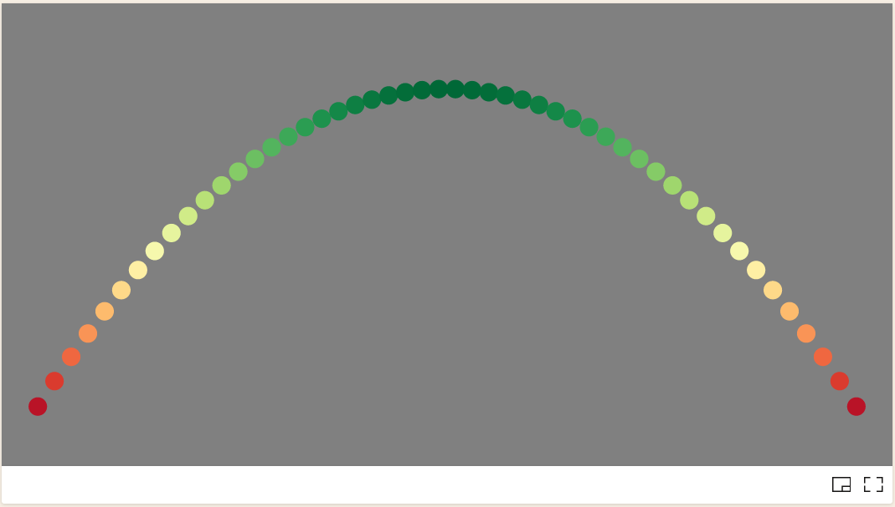

# Data Visualization Project

## Data

The data I propose to visualize for my project is the global tree coverage data from the Global Forest Service. This dataset details the change in tree cover across the globe between 2000 and 2021 for different countries. It was taken from satellite data by Hansen et. al (2013) with changing data collection methodology after this year. For this dataset, questions I would be interested in investigating include: are there differences in deforestation in different areas of the globe? Can these differences be related to economic status? Can they be related to starting forest density? What areas show reforestation?

Sources: https://www.globalforestwatch.org/dashboards/global/?category=forest-change

https://www.science.org/doi/10.1126/science.1244693

From the data coversheet: "This data set includes tree cover extent, aboveground live woody biomass (AGB) stocks and densities, annual tree cover loss, annual forest greenhouse gas (GHG) emissions, average annual forest CO2 removals (sequestration), and average annual net GHG flux at the country and first (state, province) sub-national levels. 
- Tree cover loss and emissions are available as annual data for 2001-2021. 
- Emissions, removals and net flux are available as annual averages for 2001-2021. 
- Tree cover is available for 2000 and 2010. 
- Aboveground biomass stocks and densities are available for 2000. 
The tree cover data was produced by the University of Maryland's GLAD laboratory in partnership with Google (Hansen et al. 2013). Carbon densities, emissions, removals, and net flux (megagrams CO2e/yr) are from Harris et al. 2021. The emissions data quantifies the amount of carbon dioxide emissions to the atmosphere where forest disturbances have occurred, and includes CO2, CH4, and N2O and multiple carbon pools. Removals includes the average annual carbon captured by aboveground and belowground woody biomass in forests. Net flux is the difference between average annual emissions and average annual removals; negative values are net sinks and positive values are net sources. 
Tree cover loss, tree cover extent, and AGB stock and density are presented for percent canopy cover levels >10%, 15%, 20%, 25%, 30%, 50% and 75% in 2000. Emissions, removals, and net flux are presented only for percent canopy cover levels >30%, 50%, and 75% in 2000, plus areas with tree cover gain regardless of percent canopy cover. We recommend that you select your desired percent canopy cover level before your analysis and use it consistently throughout analyses. The Global Forest Watch website uses a >30% canopy cover threshold as a default for all statistics."

The attributes of the dataset are:
| Column No. | Attribute Name | Data Type | Description |
| --- | --- | --- | --- |
| 1 | country | Categorical | Country |
| 2 | threshold | Ordinal | Percent canopy cover level in 2000 |
| 3 | area_ha | Quantitative | Country Area |
| 4 | extent_2000_ha | Quantitative | Forest extent in 2000 |
| 5 | extent_2010_ha | Quantitative | Forest extent in 2010 |
| 6 | gain_2000-2012_ha | Quantitative | Forest gain between 2000 and 2012 |
| 7-27 | tc_loss_ha_year | Quantitative | Tree cover loss per in specified year |

All data given in hectares.

## Prototypes

I’ve created a couple proof of concept visualizations of this data. The first is a scatter plot which makes use of color mapping in order to indicate the value of particular y-values. This was useful in finding a color scheme which would be useful in protraying the final data set and mapping it to data values.

The next proof of concept was to use the real data set to create scatterplot of a similat structure. This allowed me to test the color scheme on the real dataset, as well as filter out the data of interest.

Lastly, I have added axes labels to the scatter plot to increase clarity. The delta values, which are derived from the raw data, will be used in the final implementation.

## Questions & Tasks

The following tasks and questions will drive the visualization and interaction decisions for this project:

 * How does the rate of deforestation change over time?
 * What areas of the world are experiencing the most deforestation?
 * Are we losing denser forest at the same rate as more sparse forest?
 * Are there any countries exhibiting anomolous behavior in their deforestation habits?

## Sketches

## Open Questions

(describe any fear, uncertainty, or doubt you’re having about the feasibility of implementing the sketched system. For example, “I’m not sure where to get the geographic shapes to build a map from this data” or “I don’t know how to resolve the codes to meaningful names” … Feel free to delete this section if you’re confident.)

## Milestones

(for each week, estimate what would be accomplised)
